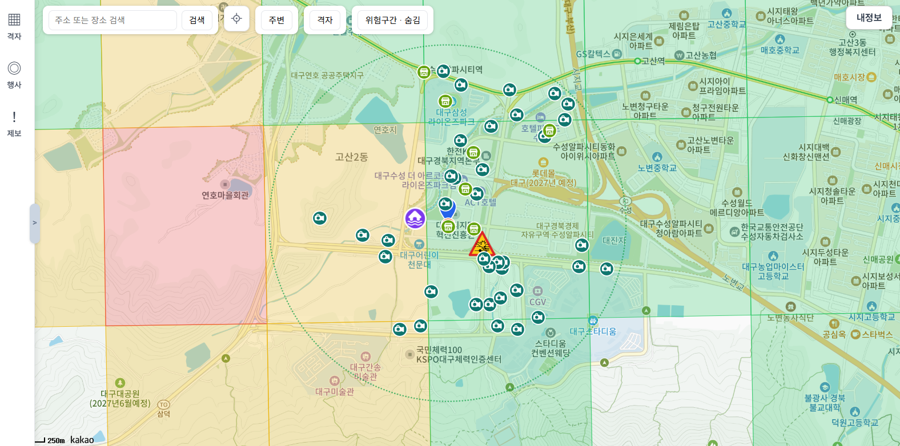
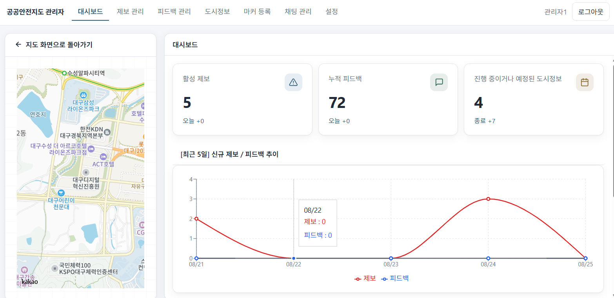
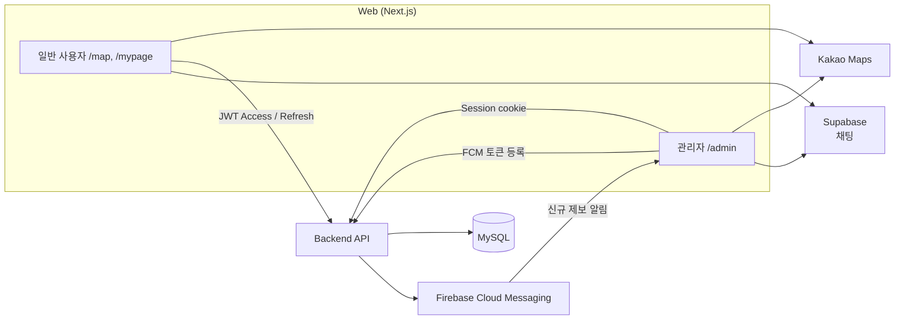

# 공공 안전 지도 (WEB version)

공공데이터로는 알 수 없는 체감 안전도를, 실시간 제보와 평가로 채운 치안 정보 지도 서비스입니다.





---

## 개요 Description

웹 버전은 앱에서 제공하는 기능을 간단히 확인하고, 내가 남긴 제보·피드백을 조회하는 화면입니다.

관리자는 관리자 페이지에서 실시간 유저 제보·피드백을 확인하고, 지도에 표시할 마커를 등록하거나 숨기며, 유저와 실시간 채팅할 수 있습니다.

---

## DEMO

[데모 링크](https://public-safety-map-web.vercel.app)

[demo.webm](https://github.com/user-attachments/assets/d4133186-0006-4605-af1f-54546d93b376)

테스트 가능 아이디
- 일반 사용자

| | |
|---|---|
| id | `test1` |
| pw | `1234` |

- 관리자 (로그인 후 내 정보에서 관리자 페이지 진입가능)

| | |
|---|---|
| id | `admin` |
| pw | `1234` |

---

## 주요 기능 Main Feature
### 지도
- **치안 인프라 확인**
- **격자별 안전등급 확인**

### 로그인

- **일반 사용자**: JWT (Access Token + Refresh Token)
- **관리자**: Session  

### 일반 사용자

- 격자 기반 안전지도 열람
- 내가 올린 제보·피드백 확인

### 관리자

- 실시간 유저 제보 확인
- 지도에 표시할 마커 등록 / 숨김
- 일반 사용자와 실시간 채팅


---

## 실행 방법 Getting Started

```bash
1. npm install
2. .env.example을 복사해 .env.local 생성 후 값 채우기
3. npm run dev
4. http://localhost:3000 접속
```

필수 환경 변수

| 변수 | 설명 |
| :--- | :--- |
| `NEXT_PUBLIC_API_BASE_URL` | 백엔드 주소 (예: `http://localhost:4100`) |
| `NEXT_PUBLIC_KAKAO_JAVASCRIPT_KEY` | 카카오맵 JavaScript 키 |
| `NEXT_PUBLIC_SUPABASE_URL` | Supabase 프로젝트 URL (채팅) |
| `NEXT_PUBLIC_SUPABASE_ANON_KEY` | Supabase anon key (채팅) |
| `NEXT_PUBLIC_FIREBASE_*` | Firebase 웹 앱 설정 (알림) |
| `NEXT_PUBLIC_FIREBASE_VAPID_KEY` | FCM 웹 푸시 VAPID 키 |

주요 경로

- 지도: `http://localhost:3000/map`
- 로그인: `http://localhost:3000/login`
- 회원가입: `http://localhost:3000/signup`
- 관리자: `http://localhost:3000/admin`

---

### Firebase 알림 (FCM) 설정

알림을 쓰려면 Firebase 웹 앱 설정이 필요합니다.
`public/firebase-messaging-sw.js`는 키를 포함하므로 git에 올리지 않습니다.

1. [Firebase Console](https://console.firebase.google.com) → 프로젝트 → 프로젝트 설정 → 일반
2. 웹 앱 설정에서 apiKey, authDomain, projectId 등 복사
3. `.env.example`을 복사해 `.env.local` 만든 뒤 `NEXT_PUBLIC_FIREBASE_*` / `VAPID_KEY` 채우기
   - VAPID 키: 프로젝트 설정 → Cloud Messaging → Web Push certificates
4. 서비스 워커 파일 생성
   ```bash
   cp public/firebase-messaging-sw.js.example public/firebase-messaging-sw.js

---

## 기술 스택 Stack

- **Next.js** — 웹 프론트엔드
- **Supabase** — 채팅 DB · 실시간 메시지
- **Firebase Cloud Messaging** — 관리자 알림
- Kakao Maps JS SDK — 지도 렌더링
- Zustand — 인증·지도·관리자 상태

---

## 프로젝트 구조 Project Structure

```
frontend/
├── app/
│   ├── layout.tsx                      # 루트 레이아웃 · AuthProvider · FCM
│   ├── page.tsx                        # / → /map 리다이렉트
│   ├── login/page.tsx                  # 로그인
│   ├── signup/page.tsx                 # 회원가입
│   ├── map/                            # 일반 사용자 지도
│   │   ├── page.tsx                    # 지도 진입점
│   │   ├── kakaoMap.tsx                # 카카오맵 · 격자/인프라/제보
│   │   ├── MapControls.tsx             # 검색 · 내 위치 · 레이어 토글
│   │   └── CityEventsPanel.tsx         # 격자·도시정보 사이드 패널
│   ├── mypage/
│   │   ├── main/page.tsx               # 내 제보·피드백
│   │   └── password/page.tsx           # 비밀번호 변경
│   └── admin/page.tsx                  # 관리자 페이지 · 권한 가드
├── components/
│   ├── login/                          # 로그인 UI · 유저 메뉴
│   ├── signup/                         # 회원가입 UI
│   ├── myPage/                         # 마이페이지 UI
│   ├── chat/                           # 사용자 채팅 FAB · 패널
│   ├── admin/                          # 관리자 셸 · 탭 · 패널
│   └── shared/
│       ├── AuthProvider.tsx            # 인증 하이드레이션
│       └── notification/               # FCM 토큰 동기화 · 토스트
├── store/
│   ├── authStore.ts                    # 로그인/로그아웃 · JWT · 세션
│   ├── mapStore.ts                     # 지도 bounds · 격자/인프라
│   └── adminStore.ts                   # 관리자 탭 · 목록 · 등록
├── lib/
│   ├── api/                            # 백엔드 API 클라이언트
│   │   ├── client.ts                   # fetch 래퍼 · 토큰 갱신
│   │   ├── auth.ts                     # 로그인 · 회원가입 · 로그아웃
│   │   ├── admin.ts                    # 관리자 CRUD
│   │   ├── mypage.ts                   # 내 제보·피드백
│   │   └── notification.ts             # FCM 토큰 등록/해제
│   ├── chat/                           # Supabase 채팅
│   ├── firebase/                       # FCM 설정 · 포그라운드 수신
│   └── supabase/                       # Supabase 클라이언트
├── public/
│   ├── firebase-messaging-sw.js        # FCM 서비스 워커
│   └── markers/                        # 지도 마커 이미지
├── .env.example
└── package.json
```

---

## 아키텍처 구조도 Architecture



- 일반 사용자: Access Token은 메모리/스토어, Refresh Token은 httpOnly 쿠키. 만료 시 `/auth/refresh`로 재발급.
- 관리자: 세션 쿠키로 인증. 동일 계정 재로그인 시 기존 세션은 서버에서 만료.
- 채팅: 백엔드를 거치지 않고 Supabase `chat_rooms` / `messages`에 직접 연동.
- 알림: 관리자 로그인 + 브라우저 알림 허용 시 FCM 토큰을 서버에 등록하고, 포그라운드에서는 토스트로 표시.

---

## 본인 역할 Role & Contribution

- 로그인 인증 (일반 사용자 JWT / 관리자 Session)
- 관리자 페이지
- 알림 기능 (Firebase Cloud Messaging)

---

